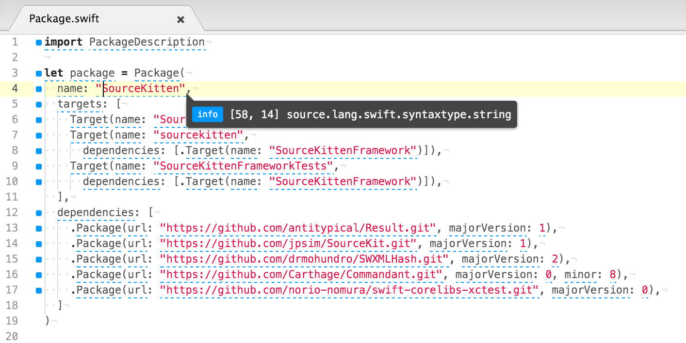

linter-sourcekitten-syntax
==========================

This linter plugin for [Linter](https://github.com/AtomLinter/Linter) provides an interface to SourceKitten's syntax information. Used with files that have the `Swift` syntax.



## Installation

As well, install [SourceKitten](https://github.com/jpsim/SourceKitten/).

### Plugin installation
```
$ apm install linter-sourcekitten-syntax
```

## Settings
You can configure linter-sourcekitten-syntax by editing ~/.atom/config.cson (choose Open Your Config in Atom menu):
```cson
  "linter-sourcekitten-syntax":
    sourcekittenExecutablePath: "/usr/local/bin/sourcekitten"
```
